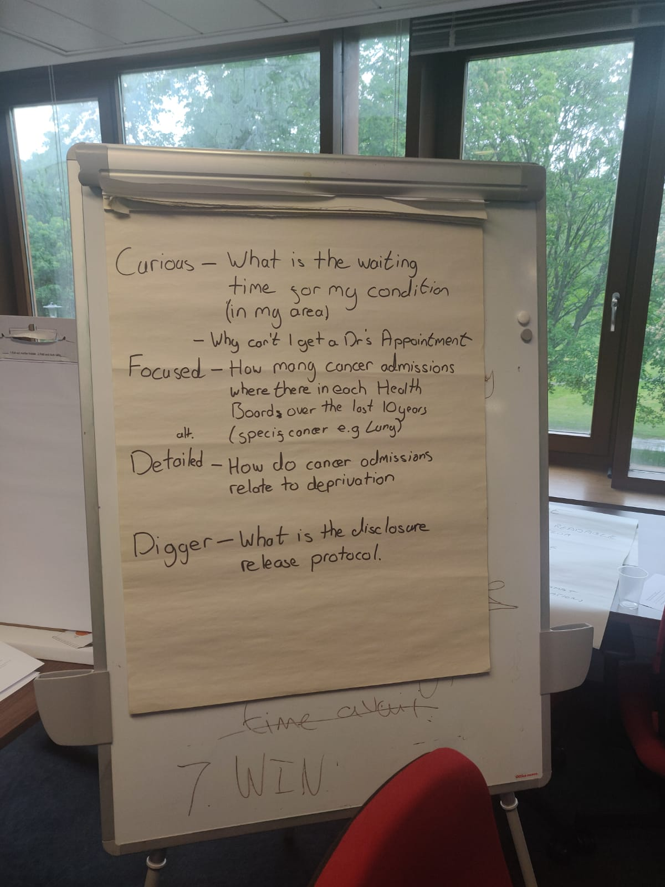
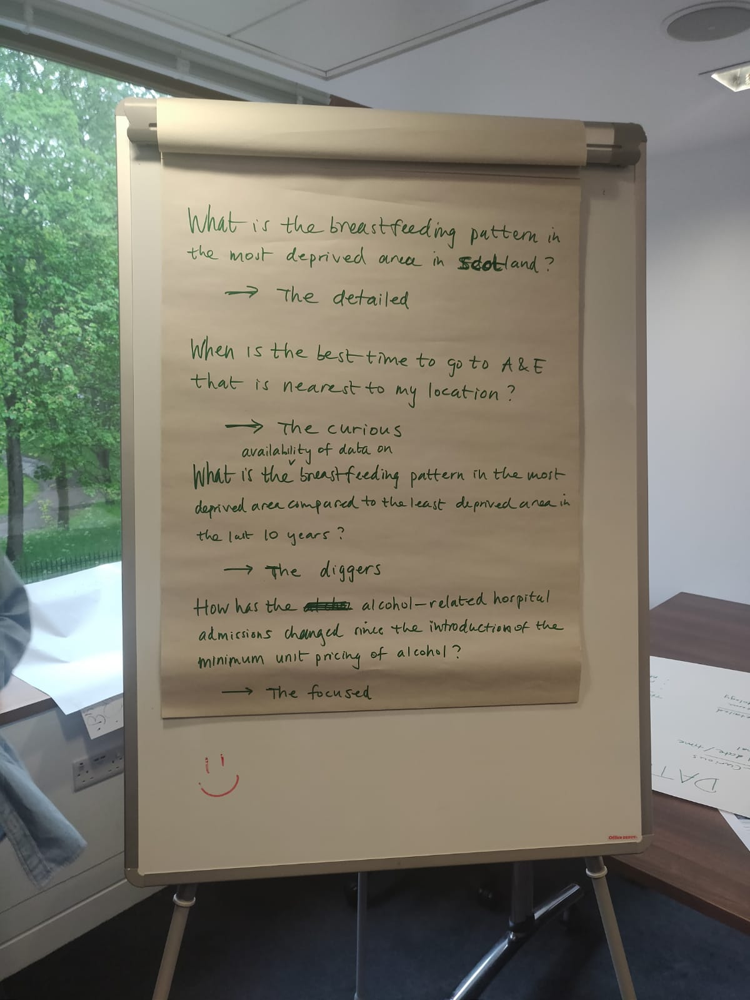
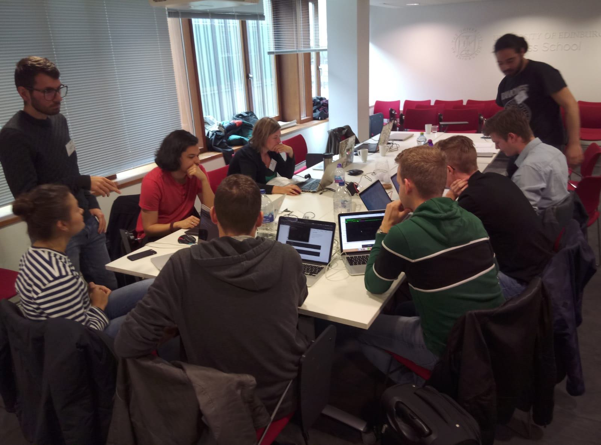
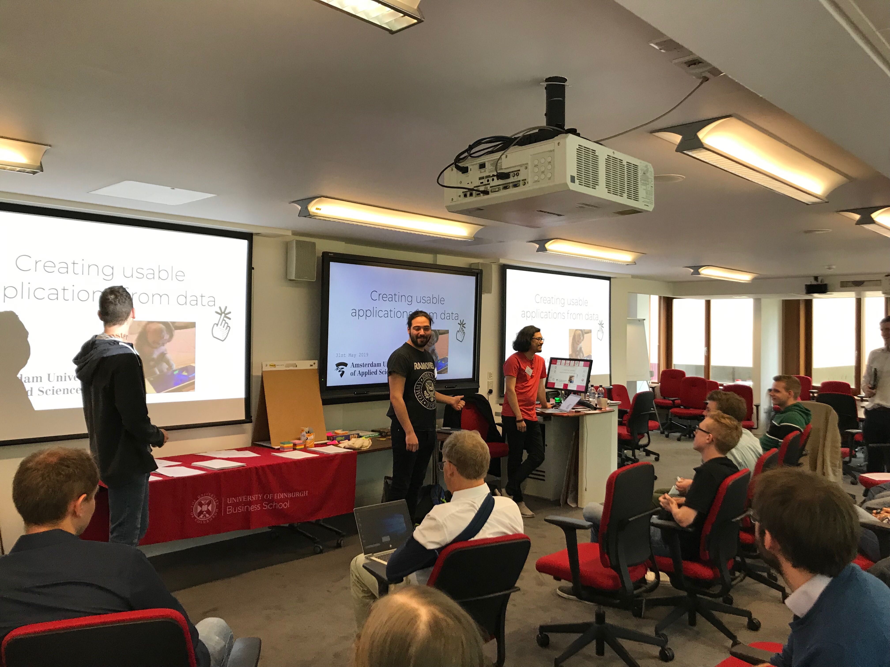
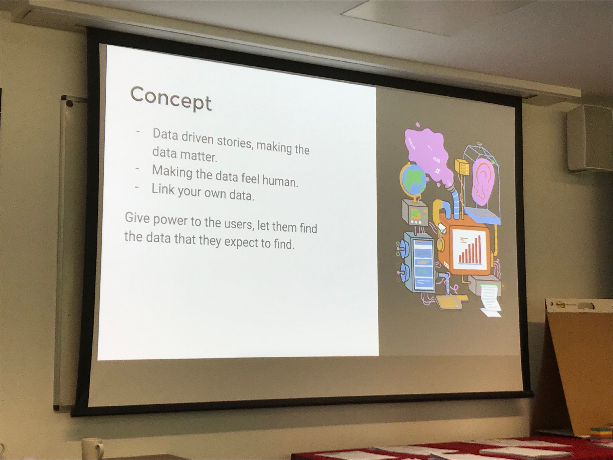
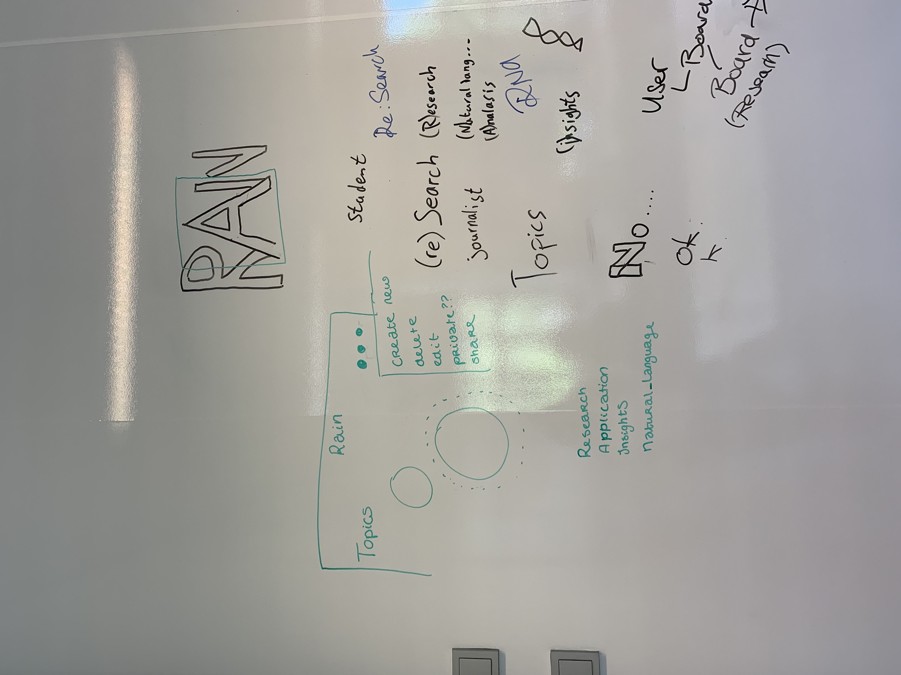

# Wallscope | Product Biography

**This my Product Biography that contains my work process, during the meesterproef @minor Web Development.**

## Week 1

On monday we had our first debriefing and met Antero from Wallscope. The UX designers from the minor UX Design were also present during this debriefing. However they had theirs from Wallscope a week earlier, then we did. During the presentation I learned a lot about Wallscope, Linked-data, Triple stores (RDF) and of course the people in Scotland, especially their humor! 

After that we just dived deeper into their tools and reports, they provided. Read through different user scenario and their target groups. I also read their article about Linked data because this was a term I was not familiar with before, same goes for Triple stores. Linked data is definitely really interesting, but also quite complicated when seeing it for the first time. Because Wallscope uses Linked data, we need to retrieve the data by means of a SPARQL query. Also something not one of us had ever worked with before. Thankfully Antero was there to help us and explain the basics of SPARQL!

The next day we did not got around doing much, because public transport had a strike. 

On wednesday it was time to go to Scotland, Edinburgh. Which was very rainy and very cold. We arrived there in the afternoon and Antero got us to the campus safely. Because it was quite late already we explored the city a bit and grabbed a bite before our big day tomorrow. 

First there was an presentation about Wallscope and ISD and what we were going to do these two days. Which mainly came down to the following. A building/concept team and a brainstorm team. After the presentation we were split from the brainstorm team and got to work in our own space. First we had introductions with the team and decided to sit all nice and cosy at one big table. This made consulting one another way easier. 

The first day we spent mainly on our concept and pitching our ideas with Antero to discuss the possibilities with their data. By the end of the day we had a lot of good ideas, but chose one main idea: a natural language search query. To create such a query we set up four questions we thought, get asked a lot at ISD. Luckily we were able to run those questions directly by the brainstorm group,where we gained even four more questions. Being there on site was definitely really helpful! At the end of the day the whole group came together again and funnily enough in the brainstorm group they also talked about a natural language search. 

The following day we each iterated on our previous ideas and started on some designs. I really liked the way how everyone worked on different designs that turned into new insights how to tackle the problem. In the afternoon we also had a quick Vue.js tutorial! 

This because at Wallscope they use Vue as a framework, which I thought was really cool. I had also never worked with this framework before, same goes for PUG for HTML. However I wasn't really sold on that idea, but did learn a lot about Vue. Which was a good thing, because at first we only considered React as a framework. One thing we did had in common was using Typescript. At the end of the day we (Specifically Maikel Sleebos) presented what we've been up to these two days and our future ideas for development. Which they were really excited about. In the evening we got to meet Ian, the CEO of Wallscope.

## Week 2

On monday we had a feedback session with Joost, talking him through our ideas and of course our experience in Scotland. In the morning we already sat together and everyone agreed that something was missing in our concept. It felt too big and there wasn't much user interaction, this also came to light during our conversation with Joost. Jesper had made some cool iterations, during our stay in Edinburgh. One of them being able to create topics to save your search results. The following day we pitched this by Wallscope through Skype and they also thought this was a great idea.

The rest of the week we mainly iterated on our concept, trying to create meaningful user interaction. Such as linking data to create your own research. After that we worked on our designs, implementing our new concept into them and trying to figure out what works the best. In the end we choose my designs, while configuring ideas of others into it. Which felt like a good approach at the time, because everyone had a say in how things should look and how it would work. But because of this we hadn't started coding yet. 

On wednesday I had a code review with Joost, talking about rubrics and things I want to lay focus on during the _meesterproef_. This being mainly User Experience design, because I always tend to leave few points here and there, that could have been avoided if I thought about it beforehand. He came up with this article about 'Accessibility and Inclusion' from Smashing Magazine, which I later used to write an article with. He also told me to look into the rubrics seeing how I could incorporate those into the project.

By the end of the week we were finally able to start coding. Which personally felt quite late, because everyone else had already started on their project. The whole week long this kept nagging my brain, so being able to finally start at the end of the week was a relieve. Because everyone knows I need the time to realise such a big concept, especially since I'm not that fast in coding yet. Our codebase was set-up by Maikel van Veen, using react as a framework, node.js server, typescript and SASS using BEM. 

I had only once worked with SASS before, but never with BEM. During this project I want to focus on the frontend, because I really feel I have some affinity there and want to focus on creating a better user experience. Maikel van Veen also suggested me being lead frontend, but I argued that I didn't have as much coding experience as everybody else so that we all should watch the frontend. This worked out really well! I also worked in branches for the first time in a group, which I also learned a lot from. Especially to check on which branch you are, before pushing everything 😅.

## Week 3

This week I mainly focused on building as much components as possible. Making sure they were generic, so that you could use them again and again. I learned a lot about classnames, a package we use and how to integrate this with BEM. Which I reckon was pretty darn cool. 

On Wednesday I sat down with Koop for my code-review. Talking about the rubrics I choose. He agreed I should focus on UX design and look into a long press button. After discussing this with the group we decided there wasn’t as of now a use case to use a long press button maybe as a next iteration if we have time. Together with Jesper we also iterated on the design, because some features weren’t designed how they should feel like. **Add design principle here**. This went on most of the week switching between building components and iterating on the design. Jesper taught me to ask why I would put some certain features into the concept, making sure to only add things that would create a added value.  However there were only made small changes. We did come up with an application name this day! 

> _**Rain**: **R**esearch, **A**pplication, **I**nsights and **N**atural language_

Sadly we hadn’t received any data yet from Wallscope, because Antero hadn’t had time to finish the query before he went on vacation. Because we contacted Antero privately through Slack we didn’t receive an answer. After contacting Wallscope we immediately received an answer and some data sets in JSON. But after looking through them there was a lot confusion... Which lead to a point where we had to decide to use mock data or try to use theirs seeing as the deadline was fast approaching.

On Friday both Maikel Sleebos and Jesper were at CSS day, which left Maikel van Veen and me to handle the Skype calls. At around 11 ‘O clock we had a Skype call with Joost were we ended up with the same conclusion creating mock data before and showing the whole idea and concept in the prototype before 2’ O clock. This was not a lot of time to create some boards and setting up mock data to use throughout our application.

Well as you probably guessed we had almost finished it in time, but six minutes before our Skype call with Wallscope everything broke. In vain Maikel tried to fix it. So we ended up showing them the same prototype as the week before and the designs with small iterations. Unfortunately we had come a long way since that week but weren’t able to show them. 

The rest of the afternoon Maikel van Veen and I switched laptops, because on mine the mistake was made and I couldn't figure out how to fix this. So I started on building the board, boards and BoardsView component. While simultaneously learning how to implement data from the backend to the frontend, kind of. In the end the bug still remains a mystery to us, but Maikel found a workaround. 

## Week 4

On monday we went back to building components. Halfway through the day Jesper and I agreed that the color scheme looked a bit wonky so we decided to change things up. After implementing our new design into  the whole Adobe XD design file we showed it to the rest of our group. Well let's say they were not amused in the least. I looked grey and depressing, so back to changing things again. In the end I settled for a vibrant purple color, that blew some life into the design, but also kept it fairly neutral. Luckily for us Wallscope told us that we are free to come up with our own colours, since they want to propose a new color scheme to ISD as well. Working in Adobe XD and switching up the whole design took up the rest of the day.

On tuesday we sat down with Joost again and told him about our kind of disastrous meeting we had on friday, but still he was very enthusiastic about the whole idea and even proposed an new one. Where we would take linking to the next level, by implementing validated links into the database so we could create more linked data. Of course because this is open source you shouldn't update every link into the data, because it might be a false presumption.

Wednesday I sat down with Koop again, where I told him I haven't gotten around to working on my personal learning goals yet. Also that we were probably not going to be able finish it in time. The advice he gave was to focus on the exposition and making sure everything was working smoothly and we provided enough information to the users that day. Workout our happy flow in the prototype, create a call-to-action on the homepage and working out some kind of zero-state.

On thursday we had a user test with an medical student who studied Biomedical sciences. Jesper took the lead in the whole user test, but I did ask some questions about the design. The overall look and feel of the whole application and what his thoughts were on dark mode. Where he straight out told us he uses it religiously the way it designed originally, by turning it on at night and manually turning it off by day. He was a student who worked more during the day, so he would probably use light mode more often than dark mode. However he did see a use case for it. And of course we know some people that always use dark mode.

On this day we also had another meeting with Wallscope talking about our design and showing them the links Maikel Sleebos worked on. Which they thought was great. I also received some feedback from their Polish designer her main feedback was to check if all the colors were accessible and provided enough contrast, which I took to heart. In between I worked a lot on building components for the frontend.

## Week 5

On monday I worked on tying all the components together and making sure everything was running smoothly. Change up some classnames to create more clarity within the application and making sure we weren't missing something. The following day we sat down with Joost again were things were really wonky and saw we lost a lot of UX points and the whole application didn't have a nice flow yet. So this day and Wednesday we spent a lot of time perfecting the prototype and writing the documentation. 

Here I will provide a list of the components I worked on. Of course during the project you always run into components that need to work together, but can't yet. So I also tweaked these a bit, even though this can't be found on the [backlog](https://github.com/Maikxx/360-wallscope/projects/1), but can be found in all my commits in the [repository](https://github.com/Maikxx/360-wallscope/commits/). And of course the other way around where someone else had to tweak mine.

Components
* Icon
* Button
* MenuBottom
* Header - adding a dropdown
* Article
* Articles
* Accordion - refactoring so it would work in react.
* Modal
* Board - basics
* Boards - basics
* Tags
* SearchQuery
* RawData
* Data
* Dropdown
* Sidebar
* Link
* Navigation
* NavLink
* ResultsView
