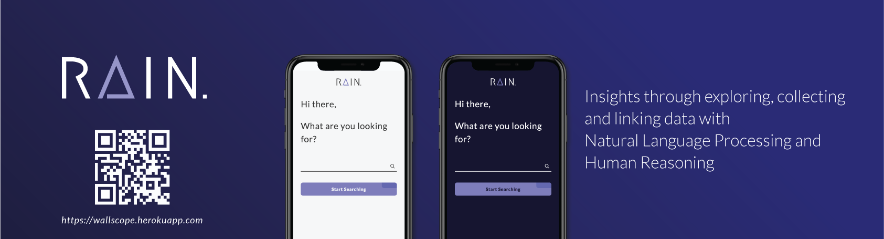
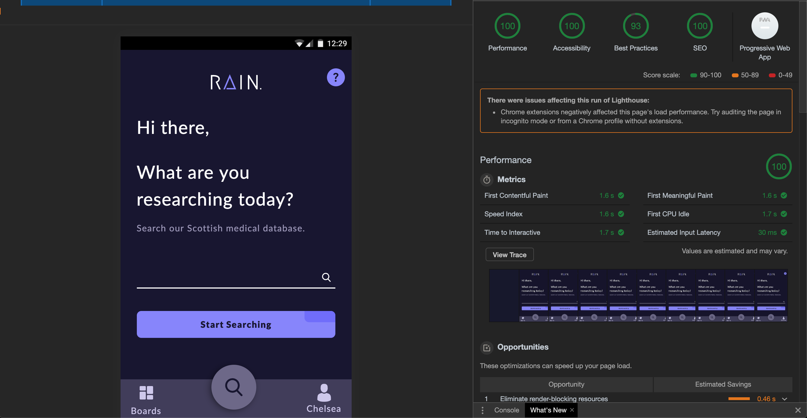

# Meesterproef 2019 @cmda-minor-web · 2018-2019

**During the meesterproef we created a prototype for Wallscope. To provide the user with medical linked data from ISD Scotland. Here you are able to find all my documentation during this project.**

The Application can be found [here](https://wallscope.herokuapp.com/) and the repository for this project [here](https://github.com/Maikxx/360-wallscope). This is a collaboration project together with [Maikel van Veen](https://github.com/Maikxx), [Jesper Ingels](https://github.com/jesperingels) & [Maikel Sleebos](https://github.com/Senpaizuri) @minor Web Development at the Amsterdam University of Applied Sciences.

## Table of Contents
* [Design rational](#Design-rational)
* [Product biography](#Product-biography)
* [Reflection](#Reflection)

## Design rational 

_Here all documentation can be found about the application and about all the design choices we made._

[Design rational](./Design_Rational.md)

## Product biography 

_This is where I documented my personal process of what I've been up to these five weeks._

[Product biography](./Product_Biography.md)

## Reflection

_Here I reflect on my learning goals I set up based on the rubrics._

| Course  | Rubric  | Achieved | Explanatory note |
|---|---|---|---|
| Web-App-From-Scratch | Creating structure into the code, by making use of patterns| 💚 | Using react creates an object oriented structure. Also working together ensures that you use a certain structure, so that everything will look the same.|
| CSS-To-The-Rescue | Using BEM to structure CSS | 💚 | For this project I had to learn BEM, because we decided to structure our CSS with this methodology to avoid unnecessary specificity problems.|
|   | Learn new CSS features | 💚 | Using an ::after and creating small animations. |
| Browser-Technologies | Comprehend a Use Case | 🧡 | Though we did this mostly as a group effort, we did create a persona and a user story. Though I feel I could have done more by creating a customer journey map and doing more desk research on the persona's. Luckily the documentation Wallscope provided was very thorough about these target groups. |
|   | Implementing 20 design principles | 🧡 | From the beginning I wanted to create an application with **One Primary action per screen**. While later on implementing other design principles from [Principles of User Interface Design](http://bokardo.com/principles-of-user-interface-design/), even though not all design principles are applicable in this prototype. I do feel like I could have done a better job in creating a better user experience design, but in the end there just wasn't enough time. |
|   | Progressive Enhancement | ❤️ | Because of limited time I didn't get around to this. But because the client of the application was build with React the whole application breaks, when turning off Javascript. I could have provided a fallback for my CSS if I had more time.|
|   | Accessibility | 💚 | Because I was mostly responsible for the designs I did focus a lot on color contrast and accessibility, making sure the application is for everybody. The user is also able navigate the application using only the keyboard and I provided aria-labels wherever necessary.  |
| Web-Design | User tests | 🧡 | I agree that we could have done a lot more here. But in the end we did do a user test, where everyone was able to ask their own question that provided us with a lot of insights. It might also be very valuable next time to do an expert test, with someone who knows a lot about user interaction |

* 💚 = achieved
* 🧡 = still in progress
* ❤️ = did not have enough time to complete this

At the beginning of this minor I wanted to learn a lot about programming, but I also wanted to dive deeper into creating a better user experience. The meesterproef seemed like a really good opportunity for me to work on these learning goals. 

I did focus a lot more on the user experience, learned how to create small animations, without going crazy. To make sure users don't suffer from motion sickness, because of them which I learned through this [article](https://www.smashingmagazine.com/2018/04/designing-accessibility-inclusion). I also learned to ask myself countless times why, why make this? What is the added value of this feature? If it is a button, why doesn't it look like a button? etc. However I did want to dive a lot deeper into separating actions, providing a good zero state and create good call-to-actions. I did think a lot about this in the beginning, but in the end I just had to let it go, because the whole frontend needed to be set up. 

I also learned the importance of iterating on a design before building everything so that later on only small iterations can be made. Colors can be easily changed, however components and their look and feel not so much. During the meesterproef I mainly spent building components, refactoring code for React, iterating on my design and working with BEM and SASS and last but definitely not least: Git. I learned how it is to work on separate branches, merging them into develop and checking everybody's code. It was the first time I worked with such a team on a project where we everyone split up into their own branch.

I can honestly say that merge conflicts for me were the worst, especially when it were big chunks of code that had been changed and I had to implement my new features and those together. Afraid I might break something in the beginning, I always asked someone to check before merging. Later on I just went and did it. Figuring out what changes had been made and then just copying mine into those, was the way I liked to solve my merge conflicts. So I have to say I have a love hate relationship with merge conflicts, because you also learn a lot from someone else's code, which I found really insightful. 

Overall the meesterproef sounded really dreading to me, but in the end it was just really awesome to use your acquired skill set from all the courses in the minor and show them off into one big project. I really think we had an awesome project! 

Wallscope had a really big use for us, where we were free to go which ever way we wanted to go. Which lead to a lot of different concepts that were just to big. Of course we wanted to create everything but the truth of the matter is that in five weeks time you are not able to realise everything. Especially because we are not all professionals. And even after choosing a concept we still had to narrow it down.

The first weeks we did not get a lot of feedback from them, which could've been really helpful during that stage. However later on we did receive some feedback although this was mainly on the design and not concept wise. Which could also be seen as a positive sign, I definitely interpret it like this. During our last Skype call, where we presented them our final prototype, they give use some useful feedback, unfortunately in that stage it was to late too make any major changes. Because we didn't have the data it was really hard to figure out what everything should look like and how it would behave in the prototype. I do think we did a really good job with our mock data, to still create a experience where the user can get some feel for the application.